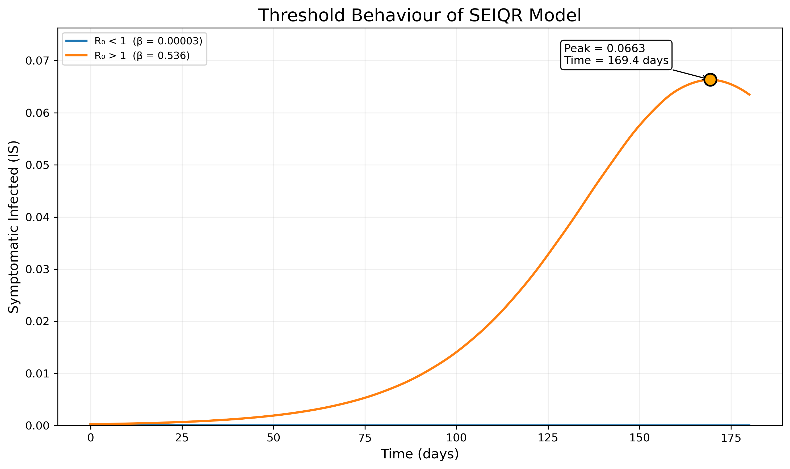
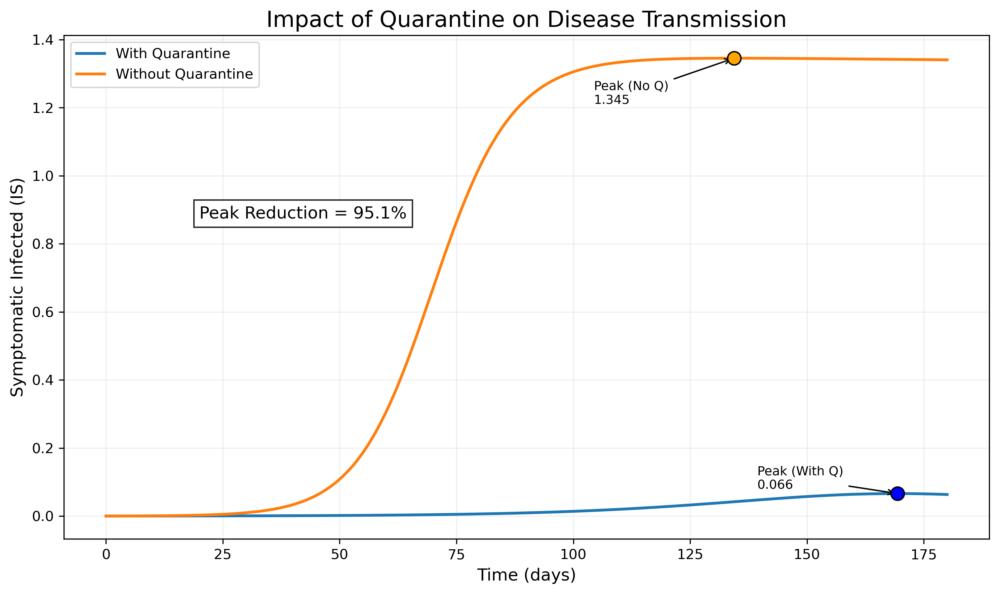

# SEIQR Epidemic Model – Data Analysis & Simulation

👩‍💻 Aina Aqiela  
🎓 Master of Applied Mathematics  
📊 Aspiring Data Analyst  

---

## Project Summary

This project implements and analyses a SEIQR epidemic transmission model using Python.

The objective is to:

- Simulate disease spread dynamics
- Evaluate the epidemic threshold condition (R0)
- Quantify the impact of quarantine intervention
- Visualize and interpret peak infection behaviour

The model is solved numerically using SciPy and visualized with Matplotlib.

---

## Threshold Behaviour Analysis

When R0 < 1, infection declines over time.  
When R0 > 1, infection grows and reaches a peak.

---

## Impact of Quarantine

Simulation results show:

- Significant reduction in peak symptomatic infection
- Delayed outbreak timing
- Controlled disease progression

---

## Technical Skills Demonstrated

- Mathematical modelling
- Differential equation simulation
- Numerical solving (SciPy – solve_ivp)
- Data visualization (Matplotlib)
- Parameter sensitivity analysis
- Reproduction number (R0) computation
- Clean scientific plotting

---

## How to Run

Install required libraries:

pip install -r requirements.txt

Run the analysis scripts to reproduce simulations and figures.

---

## Why This Project Matters

This project demonstrates:

- Strong quantitative reasoning
- Ability to translate mathematical models into actionable insights
- Data visualization for decision-making
- Analytical thinking applied to real-world scenarios
